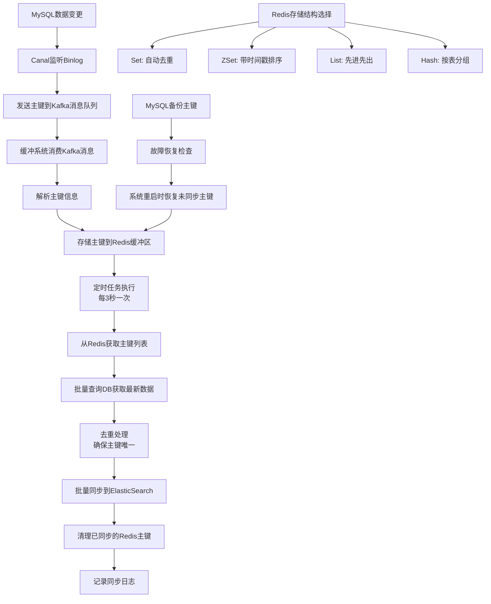

# 缓冲去重处理系统设计方案V2（基于主键缓冲）

## 1. 方案概述

### 1.1 设计变更说明
相比V1版本，V2版本的核心变更：
- **MQ消息内容**：只包含主键信息，不包含完整数据
- **Redis存储**：存储主键而非完整数据，支持多种数据结构
- **数据获取**：定时任务从Redis获取主键后，查询DB获取最新数据

### 1.2 整体架构
```
MySQL --> Canal --> Kafka(主键) --> [缓冲去重系统] --> 查询DB --> ElasticSearch
                                           |
                                    Redis集群(主键存储)
                                           |
                                    持久化存储(备份)
```

### 1.3 系统流程图



## 2. Redis存储结构方案设计

### 2.1 方案一：Set存储结构

#### 2.1.1 存储设计
```
数据结构：Set
Key格式：buffer_set:{tableName}
Value：主键集合
```

#### 2.1.2 存储示例
```redis
# 用户表主键缓冲
SADD buffer_set:user_table "123456" "123457" "123458"

# 订单表主键缓冲
SADD buffer_set:order_table "ORDER_001" "ORDER_002" "ORDER_003"

# 商品表主键缓冲
SADD buffer_set:product_table "PROD_ABC" "PROD_XYZ" "PROD_123"
```

#### 2.1.3 Java实现
```java
@Component
public class SetBufferManager {

    @Autowired
    private RedisTemplate<String, String> redisTemplate;

    private static final String SET_KEY_PREFIX = "buffer_set:";

    /**
     * 缓冲主键到Redis Set
     */
    public void bufferPrimaryKey(String tableName, String primaryKey) {
        String key = SET_KEY_PREFIX + tableName;
        redisTemplate.opsForSet().add(key, primaryKey);

        // 设置过期时间
        redisTemplate.expire(key, Duration.ofSeconds(300));

        // 备份到持久化存储
        backupPrimaryKey(tableName, primaryKey);
    }

    /**
     * 获取并清理主键
     */
    public Set<String> getAndClearPrimaryKeys(String tableName, int batchSize) {
        String key = SET_KEY_PREFIX + tableName;
        Set<String> primaryKeys = new HashSet<>();

        // 使用SPOP批量获取并删除
        for (int i = 0; i < batchSize; i++) {
            String pk = redisTemplate.opsForSet().pop(key);
            if (pk == null) break;
            primaryKeys.add(pk);
        }

        return primaryKeys;
    }

    /**
     * 获取缓冲区大小
     */
    public Long getBufferSize(String tableName) {
        String key = SET_KEY_PREFIX + tableName;
        return redisTemplate.opsForSet().size(key);
    }
}
```

### 2.2 方案二：ZSet存储结构

#### 2.2.1 存储设计
```
数据结构：ZSet (Sorted Set)
Key格式：buffer_zset:{tableName}
Value：主键
Score：时间戳
```

#### 2.2.2 存储示例
```redis
# 用户表主键缓冲（按时间戳排序）
ZADD buffer_zset:user_table 1640995200000 "123456"
ZADD buffer_zset:user_table 1640995201000 "123457"
ZADD buffer_zset:user_table 1640995202000 "123458"

# 订单表主键缓冲
ZADD buffer_zset:order_table 1640995200000 "ORDER_001"
ZADD buffer_zset:order_table 1640995201000 "ORDER_002"
```

#### 2.2.3 Java实现
```java
@Component
public class ZSetBufferManager {

    @Autowired
    private RedisTemplate<String, String> redisTemplate;

    private static final String ZSET_KEY_PREFIX = "buffer_zset:";

    /**
     * 缓冲主键到Redis ZSet
     */
    public void bufferPrimaryKey(String tableName, String primaryKey) {
        String key = ZSET_KEY_PREFIX + tableName;
        double score = System.currentTimeMillis();

        redisTemplate.opsForZSet().add(key, primaryKey, score);

        // 设置过期时间
        redisTemplate.expire(key, Duration.ofSeconds(300));

        // 备份到持久化存储
        backupPrimaryKey(tableName, primaryKey);
    }

    /**
     * 获取指定数量的最早主键
     */
    public Set<String> getEarliestPrimaryKeys(String tableName, int count) {
        String key = ZSET_KEY_PREFIX + tableName;
        return redisTemplate.opsForZSet().range(key, 0, count - 1);
    }

    /**
     * 获取指定时间范围内的主键
     */
    public Set<String> getPrimaryKeysByTimeRange(String tableName, long startTime, long endTime) {
        String key = ZSET_KEY_PREFIX + tableName;
        return redisTemplate.opsForZSet().rangeByScore(key, startTime, endTime);
    }

    /**
     * 删除已处理的主键
     */
    public void removeProcessedKeys(String tableName, Set<String> primaryKeys) {
        String key = ZSET_KEY_PREFIX + tableName;
        String[] keys = primaryKeys.toArray(new String[0]);
        redisTemplate.opsForZSet().remove(key, (Object[]) keys);
    }

    /**
     * 清理过期主键
     */
    public void cleanupExpiredKeys(String tableName, long beforeTime) {
        String key = ZSET_KEY_PREFIX + tableName;
        redisTemplate.opsForZSet().removeRangeByScore(key, 0, beforeTime);
    }
}
```

### 2.3 方案三：List存储结构

#### 2.3.1 存储设计
```
数据结构：List
Key格式：buffer_list:{tableName}
Value：主键（先进先出）
```

#### 2.3.2 存储示例
```redis
# 用户表主键缓冲（按时间顺序）
LPUSH buffer_list:user_table "123456" "123457" "123458"

# 订单表主键缓冲
LPUSH buffer_list:order_table "ORDER_001" "ORDER_002" "ORDER_003"
```

#### 2.3.3 Java实现
```java
@Component
public class ListBufferManager {

    @Autowired
    private RedisTemplate<String, String> redisTemplate;

    private static final String LIST_KEY_PREFIX = "buffer_list:";

    /**
     * 缓冲主键到Redis List
     */
    public void bufferPrimaryKey(String tableName, String primaryKey) {
        String key = LIST_KEY_PREFIX + tableName;

        // 使用LPUSH添加到列表头部
        redisTemplate.opsForList().leftPush(key, primaryKey);

        // 设置过期时间
        redisTemplate.expire(key, Duration.ofSeconds(300));

        // 备份到持久化存储
        backupPrimaryKey(tableName, primaryKey);
    }

    /**
     * 批量获取主键
     */
    public List<String> getBatchPrimaryKeys(String tableName, int batchSize) {
        String key = LIST_KEY_PREFIX + tableName;
        List<String> primaryKeys = new ArrayList<>();

        // 使用RPOP从列表尾部弹出
        for (int i = 0; i < batchSize; i++) {
            String pk = redisTemplate.opsForList().rightPop(key);
            if (pk == null) break;
            primaryKeys.add(pk);
        }

        return primaryKeys;
    }

    /**
     * 获取缓冲区大小
     */
    public Long getBufferSize(String tableName) {
        String key = LIST_KEY_PREFIX + tableName;
        return redisTemplate.opsForList().size(key);
    }

    /**
     * 去重处理（List本身不去重，需要手动处理）
     */
    public List<String> deduplicateKeys(List<String> primaryKeys) {
        return primaryKeys.stream()
                         .distinct()
                         .collect(Collectors.toList());
    }
}
```

### 2.4 方案四：Hash存储结构

#### 2.4.1 存储设计
```
数据结构：Hash
Key格式：buffer_hash:{tableName}
Field：主键
Value：时间戳
```

#### 2.4.2 存储示例
```redis
# 用户表主键缓冲
HSET buffer_hash:user_table "123456" "1640995200000"
HSET buffer_hash:user_table "123457" "1640995201000"
HSET buffer_hash:user_table "123458" "1640995202000"

# 订单表主键缓冲
HSET buffer_hash:order_table "ORDER_001" "1640995200000"
HSET buffer_hash:order_table "ORDER_002" "1640995201000"
```

#### 2.4.3 Java实现
```java
@Component
public class HashBufferManager {

    @Autowired
    private RedisTemplate<String, String> redisTemplate;

    private static final String HASH_KEY_PREFIX = "buffer_hash:";

    /**
     * 缓冲主键到Redis Hash
     */
    public void bufferPrimaryKey(String tableName, String primaryKey) {
        String key = HASH_KEY_PREFIX + tableName;
        String timestamp = String.valueOf(System.currentTimeMillis());

        redisTemplate.opsForHash().put(key, primaryKey, timestamp);

        // 设置过期时间
        redisTemplate.expire(key, Duration.ofSeconds(300));

        // 备份到持久化存储
        backupPrimaryKey(tableName, primaryKey);
    }

    /**
     * 获取所有主键
     */
    public Set<String> getAllPrimaryKeys(String tableName) {
        String key = HASH_KEY_PREFIX + tableName;
        return redisTemplate.opsForHash().keys(key).stream()
                           .map(Object::toString)
                           .collect(Collectors.toSet());
    }

    /**
     * 获取主键及其时间戳
     */
    public Map<String, String> getAllPrimaryKeysWithTimestamp(String tableName) {
        String key = HASH_KEY_PREFIX + tableName;
        return redisTemplate.opsForHash().entries(key).entrySet().stream()
                           .collect(Collectors.toMap(
                               e -> e.getKey().toString(),
                               e -> e.getValue().toString()
                           ));
    }

    /**
     * 删除已处理的主键
     */
    public void removeProcessedKeys(String tableName, Set<String> primaryKeys) {
        String key = HASH_KEY_PREFIX + tableName;
        String[] fields = primaryKeys.toArray(new String[0]);
        redisTemplate.opsForHash().delete(key, (Object[]) fields);
    }

    /**
     * 按时间戳排序获取主键
     */
    public List<String> getPrimaryKeysSortedByTime(String tableName) {
        Map<String, String> data = getAllPrimaryKeysWithTimestamp(tableName);

        return data.entrySet().stream()
                   .sorted(Map.Entry.comparingByValue())
                   .map(Map.Entry::getKey)
                   .collect(Collectors.toList());
    }
}
```

## 3. 定时任务处理流程

### 3.1 通用处理流程

```java
@Component
public class PrimaryKeyProcessor {

    @Autowired
    private UserService userService;

    @Autowired
    private ElasticsearchService elasticsearchService;

    @Autowired
    private BufferManager bufferManager; // 可替换为不同的实现

    /**
     * 定时处理主键
     */
    @Scheduled(fixedDelay = 3000)
    public void processPrimaryKeys() {
        List<String> tableNames = getMonitoredTables();

        tableNames.parallelStream().forEach(tableName -> {
            try {
                processSingleTable(tableName);
            } catch (Exception e) {
                log.error("处理表 {} 主键时发生错误", tableName, e);
            }
        });
    }

    private void processSingleTable(String tableName) {
        // 1. 从Redis获取主键
        Set<String> primaryKeys = bufferManager.getPrimaryKeys(tableName, 1000);

        if (primaryKeys.isEmpty()) {
            return;
        }

        // 2. 批量查询DB获取最新数据
        List<Object> records = queryDatabaseBatch(tableName, primaryKeys);

        // 3. 批量同步到ES
        batchSyncToElasticsearch(tableName, records);

        // 4. 清理已同步的主键
        bufferManager.removeProcessedKeys(tableName, primaryKeys);
    }

    /**
     * 批量查询数据库
     */
    private List<Object> queryDatabaseBatch(String tableName, Set<String> primaryKeys) {
        switch (tableName) {
            case "user_table":
                return userService.batchFindByIds(primaryKeys);
            case "order_table":
                return orderService.batchFindByIds(primaryKeys);
            case "product_table":
                return productService.batchFindByIds(primaryKeys);
            default:
                throw new IllegalArgumentException("不支持的表名: " + tableName);
        }
    }
}
```

### 3.2 具体处理示例

#### 3.2.1 使用Set结构的处理流程
```java
// 1. 从Redis Set获取主键
Set<String> primaryKeys = redisTemplate.opsForSet().members("buffer_set:user_table");
// 结果: ["123456", "123457", "123458"]

// 2. 批量查询DB
List<User> users = userService.batchFindByIds(primaryKeys);
// 结果: [
//   User{id=123456, name="张三", age=27, email="zhangsan@example.com"},
//   User{id=123457, name="李四", age=30, email="lisi@example.com"},
//   User{id=123458, name="王五", age=25, email="wangwu@example.com"}
// ]

// 3. 同步到ES
elasticsearchService.batchIndex("user_index", users);

// 4. 清理Redis
redisTemplate.delete("buffer_set:user_table");
```

#### 3.2.2 使用ZSet结构的处理流程
```java
// 1. 从Redis ZSet获取最早的主键
Set<String> primaryKeys = redisTemplate.opsForZSet().range("buffer_zset:user_table", 0, 999);
// 结果: ["123456", "123457", "123458"] (按时间戳排序)

// 2. 批量查询DB
List<User> users = userService.batchFindByIds(primaryKeys);

// 3. 同步到ES
elasticsearchService.batchIndex("user_index", users);

// 4. 清理Redis
redisTemplate.opsForZSet().remove("buffer_zset:user_table", primaryKeys.toArray());
```

## 4. 方案对比分析

### 4.1 V1 vs V2 整体对比

| 对比项 | V1版本(String存储完整数据) | V2版本(存储主键) |
|--------|---------------------------|------------------|
| **MQ消息大小** | 大（包含完整数据） | 小（仅主键） |
| **Redis内存占用** | 高（存储完整数据） | 低（仅存储主键） |
| **数据一致性** | 可能不一致（缓存数据） | 强一致（实时查询DB） |
| **DB查询压力** | 无额外压力 | 增加批量查询压力 |
| **网络带宽** | MQ网络压力大 | DB网络压力增加 |
| **实时性** | 高（直接使用缓存数据） | 中（需要查询DB） |
| **扩展性** | 受Redis内存限制 | 受DB查询能力限制 |

### 4.2 V2版本不同Redis结构对比

| 对比项 | Set | ZSet | List | Hash |
|--------|-----|------|------|------|
| **自动去重** | ✅ | ✅ | ❌ | ✅ |
| **时间排序** | ❌ | ✅ | ✅ | ✅(需处理) |
| **内存效率** | 高 | 中 | 高 | 中 |
| **操作复杂度** | O(1) | O(log N) | O(1) | O(1) |
| **范围查询** | ❌ | ✅ | ❌ | ❌ |
| **FIFO特性** | ❌ | ✅ | ✅ | ❌ |

### 4.3 详细优缺点分析

#### 4.3.1 Set存储方案
**优点：**
- 自动去重，无需额外处理
- 内存效率高
- 操作简单，复杂度O(1)
- 适合不需要顺序的场景

**缺点：**
- 无法保持时间顺序
- 无法获取时间信息
- 无法实现FIFO处理

**适用场景：**
- 主键去重需求强烈
- 不关心处理顺序
- 内存资源有限

#### 4.3.2 ZSet存储方案
**优点：**
- 自动去重
- 支持时间排序
- 支持范围查询
- 可以实现定时清理

**缺点：**
- 内存占用稍高（需要存储score）
- 操作复杂度O(log N)
- 实现相对复杂

**适用场景：**
- 需要按时间处理
- 需要范围查询
- 需要定时清理功能

#### 4.3.3 List存储方案
**优点：**
- 保持插入顺序
- 支持FIFO处理
- 内存效率高
- 操作简单

**缺点：**
- 不自动去重
- 可能出现重复主键
- 无法随机访问

**适用场景：**
- 需要严格按顺序处理
- 允许重复主键
- 简单的队列场景

#### 4.3.4 Hash存储方案
**优点：**
- 自动去重
- 可以存储时间戳
- 支持批量操作
- 可以实现复杂查询

**缺点：**
- 内存占用较高
- 排序需要额外处理
- 实现相对复杂

**适用场景：**
- 需要存储额外信息
- 需要复杂查询
- 对内存不敏感

## 5. 推荐方案

### 5.1 推荐使用ZSet存储方案

基于以下考虑推荐ZSet方案：

1. **自动去重**：避免重复处理同一主键
2. **时间排序**：可以按时间顺序处理，保证数据时效性
3. **范围查询**：支持按时间范围清理过期数据
4. **平衡性好**：在功能和性能之间取得良好平衡

### 5.2 推荐实现代码

```java
@Component
public class RecommendedBufferManager {

    @Autowired
    private RedisTemplate<String, String> redisTemplate;

    private static final String BUFFER_KEY_PREFIX = "buffer_zset:";

    /**
     * 缓冲主键
     */
    public void bufferPrimaryKey(String tableName, String primaryKey) {
        String key = BUFFER_KEY_PREFIX + tableName;
        double score = System.currentTimeMillis();

        redisTemplate.opsForZSet().add(key, primaryKey, score);
        redisTemplate.expire(key, Duration.ofMinutes(5));

        // 异步备份
        CompletableFuture.runAsync(() -> backupPrimaryKey(tableName, primaryKey));
    }

    /**
     * 获取待处理主键
     */
    public Set<String> getProcessingKeys(String tableName, int batchSize) {
        String key = BUFFER_KEY_PREFIX + tableName;
        return redisTemplate.opsForZSet().range(key, 0, batchSize - 1);
    }

    /**
     * 清理已处理主键
     */
    public void cleanupProcessedKeys(String tableName, Set<String> primaryKeys) {
        String key = BUFFER_KEY_PREFIX + tableName;
        redisTemplate.opsForZSet().remove(key, primaryKeys.toArray());
    }

    /**
     * 定时清理过期数据
     */
    @Scheduled(fixedDelay = 60000) // 每分钟清理一次
    public void cleanupExpiredData() {
        long expireTime = System.currentTimeMillis() - Duration.ofMinutes(10).toMillis();

        getMonitoredTables().forEach(tableName -> {
            String key = BUFFER_KEY_PREFIX + tableName;
            long removed = redisTemplate.opsForZSet().removeRangeByScore(key, 0, expireTime);
            if (removed > 0) {
                log.info("清理过期主键: table={}, count={}", tableName, removed);
            }
        });
    }
}
```

## 6. Redis过期时间设计详解

### 6.1 过期时间设置的必要性

#### 6.1.1 核心考虑因素
1. **防止内存泄漏**：避免异常情况下数据无限积累
2. **容错机制**：定时任务失败时的自动清理
3. **资源管理**：确保Redis内存使用有界
4. **系统稳定性**：异常场景下的自动恢复

#### 6.1.2 过期时间选择分析

| 时间设置 | 优点 | 缺点 | 适用场景 |
|----------|------|------|----------|
| **30秒** | 内存占用小 | 容错时间不足 | 低延迟要求 |
| **1分钟** | 较小内存占用 | 重试时间紧张 | 一般业务 |
| **5分钟** | 容错时间充分 | 内存占用适中 | **推荐选择** |
| **10分钟** | 容错时间过长 | 内存占用较大 | 高容错要求 |
| **无过期** | 数据不丢失 | 内存泄漏风险 | ❌ 不推荐 |

#### 6.1.3 时间窗口设计

```java
// 时间关系设计
public class TimeWindowConfig {
    private static final int PROCESS_INTERVAL = 3;      // 定时任务间隔：3秒
    private static final int RETRY_TIMEOUT = 60;        // 重试超时：1分钟
    private static final int EXPIRE_TIME = 300;         // 过期时间：5分钟

    // 时间关系验证
    static {
        assert PROCESS_INTERVAL < RETRY_TIMEOUT;         // 处理间隔 < 重试时间
        assert RETRY_TIMEOUT < EXPIRE_TIME;              // 重试时间 < 过期时间
        assert EXPIRE_TIME > PROCESS_INTERVAL * 10;      // 过期时间 > 10个处理周期
    }
}
```

### 6.2 异常场景分析

#### 6.2.1 系统宕机恢复

```java
// 场景：系统在数据写入Redis后宕机
Timeline timeline = new Timeline();
timeline.addEvent(0, "数据写入Redis，设置5分钟过期");
timeline.addEvent(10, "系统宕机");
timeline.addEvent(300, "Redis自动清理过期数据");
timeline.addEvent(600, "系统重启，从备份表恢复数据");

// 结果：数据不会丢失，内存也不会泄漏
```

#### 6.2.2 定时任务异常

```java
// 场景：定时任务代码异常
@Scheduled(fixedDelay = 3000)
public void processBufferedData() {
    try {
        // 正常处理逻辑
        processData();
    } catch (Exception e) {
        log.error("定时任务异常", e);
        // 即使处理失败，Redis也会在5分钟后自动清理
        // 数据通过备份机制保证不丢失
    }
}
```

#### 6.2.3 网络分区场景

```java
// 场景：Redis网络分区导致无法清理数据
// 时间点0-180秒: 网络正常，数据正常处理
// 时间点180-240秒: 网络分区，无法清理Redis
// 时间点240-300秒: 网络恢复，但已接近过期时间
// 时间点300秒: Redis自动清理，避免内存泄漏
```

### 6.3 内存使用量计算

#### 6.3.1 内存占用估算

```java
// 基于5分钟过期时间的内存占用计算
public class MemoryCalculator {

    /**
     * 计算最大内存占用
     * @param writeRate 每秒写入的主键数量
     * @param keySize 平均主键大小（字节）
     * @param expireTime 过期时间（秒）
     * @return 最大内存占用（字节）
     */
    public long calculateMaxMemory(int writeRate, int keySize, int expireTime) {
        // 最大主键数量 = 写入速率 × 过期时间
        long maxKeys = writeRate * expireTime;

        // 内存占用 = 主键数量 × 平均大小 × 存储开销
        return maxKeys * keySize * 1.5; // 1.5倍开销（Redis存储开销）
    }

    // 示例计算
    public void example() {
        int writeRate = 1000;    // 每秒1000个主键
        int keySize = 20;        // 平均主键20字节
        int expireTime = 300;    // 5分钟过期

        long maxMemory = calculateMaxMemory(writeRate, keySize, expireTime);
        System.out.println("最大内存占用: " + maxMemory / (1024 * 1024) + " MB");
        // 结果: 最大内存占用: 8.58 MB
    }
}
```

#### 6.3.2 不同过期时间的内存对比

```java
// 不同过期时间的内存占用对比（假设每秒1000个主键）
Map<String, Long> memoryUsage = Map.of(
    "30秒",  calculateMemory(1000, 20, 30),   // 0.86 MB
    "1分钟", calculateMemory(1000, 20, 60),   // 1.72 MB
    "5分钟", calculateMemory(1000, 20, 300),  // 8.58 MB
    "10分钟", calculateMemory(1000, 20, 600), // 17.16 MB
    "无过期", Long.MAX_VALUE                   // 无限增长
);
```

### 6.4 过期时间动态调整策略

#### 6.4.1 基于业务负载调整

```java
@Component
public class DynamicExpireTimeManager {

    private static final int BASE_EXPIRE_TIME = 300; // 基础5分钟
    private static final int MIN_EXPIRE_TIME = 60;   // 最小1分钟
    private static final int MAX_EXPIRE_TIME = 900;  // 最大15分钟

    /**
     * 根据系统负载动态调整过期时间
     */
    public int calculateExpireTime() {
        // 获取系统指标
        SystemMetrics metrics = getSystemMetrics();

        int expireTime = BASE_EXPIRE_TIME;

        // 根据内存使用率调整
        if (metrics.getMemoryUsage() > 0.8) {
            expireTime = Math.max(MIN_EXPIRE_TIME, expireTime / 2);
        } else if (metrics.getMemoryUsage() < 0.5) {
            expireTime = Math.min(MAX_EXPIRE_TIME, expireTime * 2);
        }

        // 根据处理延迟调整
        if (metrics.getProcessingDelay() > 60) {
            expireTime = Math.min(MAX_EXPIRE_TIME, expireTime * 2);
        }

        return expireTime;
    }
}
```

#### 6.4.2 基于数据量调整

```java
/**
 * 根据缓冲区数据量动态调整过期时间
 */
public int adjustExpireTimeByDataSize(String tableName) {
    Long bufferSize = getBufferSize(tableName);

    if (bufferSize > 100000) {        // 超过10万条
        return 60;                    // 缩短到1分钟
    } else if (bufferSize > 50000) {  // 超过5万条
        return 180;                   // 缩短到3分钟
    } else {
        return 300;                   // 保持5分钟
    }
}
```

### 6.5 监控和告警

#### 6.5.1 过期时间相关监控

```java
@Component
public class ExpireTimeMonitor {

    /**
     * 监控即将过期的数据
     */
    @Scheduled(fixedDelay = 30000)
    public void monitorExpiringData() {
        getMonitoredTables().forEach(tableName -> {
            String key = BUFFER_KEY_PREFIX + tableName;
            Long ttl = redisTemplate.getExpire(key);

            if (ttl != null && ttl > 0 && ttl < 30) {
                log.warn("数据即将过期: table={}, ttl={}秒", tableName, ttl);
                // 发送告警
                alertService.sendAlert("数据即将过期", tableName, ttl);
            }
        });
    }
}
```

## 7. 总结

V2版本设计通过存储主键而非完整数据，实现了以下优势：

1. **减少内存占用**：Redis只存储主键，内存效率大幅提升
2. **提高数据一致性**：实时查询DB，保证数据最新
3. **降低MQ压力**：消息只包含主键，减少网络传输
4. **提升扩展性**：不受Redis内存限制，可处理更大数据量
5. **完善的容错机制**：通过合理的过期时间设计，确保系统稳定性

**过期时间设计原则：**
- 过期时间应该大于正常处理周期的10倍以上
- 考虑异常重试和网络延迟的缓冲时间
- 平衡内存使用和容错能力
- 支持动态调整以适应不同负载

推荐使用ZSet存储方案配合5分钟过期时间，在功能完整性、性能和稳定性之间取得最佳平衡。