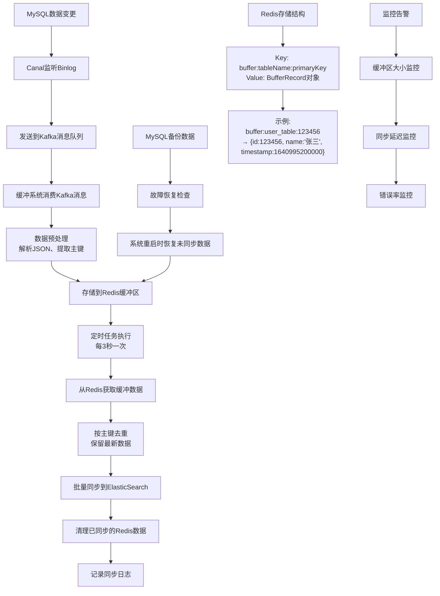
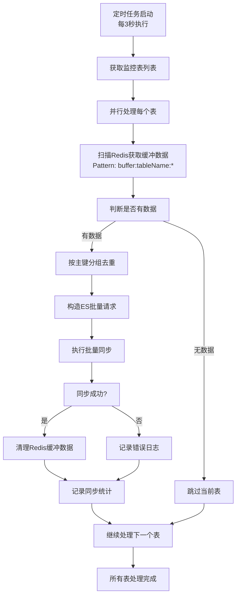

# 缓冲去重处理系统设计方案

## 1. 系统架构概述

### 1.1 整体架构
```
MySQL --> Canal --> Kafka --> [缓冲去重系统] --> ElasticSearch
                                      |
                                   Redis集群
                                      |
                                   持久化存储
```

### 1.2 核心组件
- **缓冲层**：基于Redis实现的内存缓冲区
- **去重处理器**：负责主键去重逻辑的核心组件
- **定时同步器**：按时间窗口批量同步数据
- **故障恢复模块**：保证数据可靠性的容错机制
- **监控告警模块**：系统运行状态监控

### 1.3 系统整体流程图



### 1.4 系统流程详细说明

#### 1.4.1 数据流入阶段
1. **MySQL数据变更**：业务系统对MySQL数据库进行增删改操作
2. **Canal监听**：Canal实时监听MySQL的binlog变更日志
3. **Kafka消息**：Canal将binlog解析后发送到Kafka指定topic
4. **消息消费**：缓冲系统作为Kafka消费者，实时消费变更消息

#### 1.4.2 缓冲处理阶段
1. **数据预处理**：解析Kafka消息，提取表名、主键、操作类型、数据内容
2. **Redis存储**：将处理后的数据存入Redis，使用特定的Key-Value结构
3. **数据覆盖**：相同主键的数据在Redis中会被覆盖，保证最新数据优先

#### 1.4.3 去重同步阶段
1. **定时触发**：每3秒执行一次定时任务，扫描Redis缓冲区
2. **数据获取**：按表名批量获取Redis中的缓冲数据
3. **去重处理**：对获取的数据按主键去重，保留时间戳最新的记录
4. **批量同步**：将去重后的数据批量同步到ElasticSearch
5. **清理缓存**：同步成功后清理Redis中对应的缓冲数据

#### 1.4.4 容错恢复阶段
1. **数据备份**：所有缓冲数据同时写入MySQL备份表
2. **故障检测**：系统启动时检查是否有未同步的数据
3. **数据恢复**：将备份表中未同步的数据重新加载到Redis缓冲区

## 2. 系统功能设计

### 2.1 核心功能
1. **数据缓冲**：将Kafka消息缓存到Redis，按主键分组
2. **去重处理**：在时间窗口内，只保留最新的数据变更
3. **批量同步**：定时将缓冲区数据批量同步到ES
4. **故障恢复**：确保系统重启后数据不丢失
5. **扩展支持**：支持水平扩展和负载均衡

### 2.2 数据流转过程
```
1. 接收Kafka消息 → 2. 数据预处理 → 3. Redis缓冲 → 4. 去重处理 → 5. 批量同步ES
```

## 3. 系统实现方案

### 3.1 技术架构选型

#### 3.1.1 核心技术栈
- **开发语言**：Java 8
- **缓存层**：Redis 6.x（集群模式）
- **消息队列**：Kafka 2.x
- **持久化**：MySQL 8.x（元数据存储）
- **框架**：Spring Boot 2.x + Spring Cloud
- **监控**：Micrometer + Prometheus + Grafana

#### 3.1.2 中间件选择
- **Redis Cluster**：提供高可用缓存服务
- **Kafka Consumer**：消费binlog消息
- **ElasticSearch Client**：高性能ES操作客户端
- **Curator**：Zookeeper客户端（分布式锁）

### 3.2 核心模块实现

#### 3.2.1 数据结构设计

```java
// Redis中的数据结构
public class BufferRecord {
    private String primaryKey;      // 主键
    private String tableName;       // 表名
    private String operation;       // 操作类型（INSERT/UPDATE/DELETE）
    private String data;           // 数据内容（JSON格式）
    private Long timestamp;        // 时间戳
    private String checksum;       // 数据校验和
}

// Redis Key设计
// 格式：buffer:{tableName}:{primaryKey}
// 示例：buffer:user_table:123456
```

#### 3.2.2 Redis存储结构详细说明

##### 3.2.2.1 Redis数据结构选择
- **存储类型**：使用Redis的String类型存储序列化后的BufferRecord对象
- **序列化方式**：采用JSON格式，便于调试和跨语言兼容
- **过期策略**：设置5分钟过期时间，防止内存溢出

##### 3.2.2.2 Key设计规范
```
Key格式：buffer:{tableName}:{primaryKey}

组成部分：
- buffer：固定前缀，用于区分不同业务数据
- tableName：数据库表名，支持多表同时缓冲
- primaryKey：数据主键，保证唯一性

示例：
buffer:user_table:123456
buffer:order_table:ORDER_2024_001
buffer:product_table:PROD_ABC123
```

##### 3.2.2.3 Value结构设计
```json
{
    "primaryKey": "123456",
    "tableName": "user_table",
    "operation": "UPDATE",
    "data": "{\"id\":123456,\"name\":\"张三\",\"age\":25,\"email\":\"zhangsan@example.com\",\"update_time\":\"2024-01-01 10:30:00\"}",
    "timestamp": 1640995200000,
    "checksum": "d41d8cd98f00b204e9800998ecf8427e"
}
```

##### 3.2.2.4 多条变更记录存储示例

**场景**：用户表ID为123456的记录在3秒内发生了3次变更

**第1次变更**（10:30:00）：
```
Key: buffer:user_table:123456
Value: {
    "primaryKey": "123456",
    "tableName": "user_table",
    "operation": "UPDATE",
    "data": "{\"id\":123456,\"name\":\"张三\",\"age\":25,\"email\":\"zhangsan@example.com\",\"update_time\":\"2024-01-01 10:30:00\"}",
    "timestamp": 1640995200000,
    "checksum": "abc123"
}
```

**第2次变更**（10:30:01）：
```
Key: buffer:user_table:123456  // 相同Key
Value: {
    "primaryKey": "123456",
    "tableName": "user_table",
    "operation": "UPDATE",
    "data": "{\"id\":123456,\"name\":\"张三\",\"age\":26,\"email\":\"zhangsan@example.com\",\"update_time\":\"2024-01-01 10:30:01\"}",
    "timestamp": 1640995201000,  // 时间戳更新
    "checksum": "def456"
}
```

**第3次变更**（10:30:02）：
```
Key: buffer:user_table:123456  // 相同Key，覆盖前面的值
Value: {
    "primaryKey": "123456",
    "tableName": "user_table",
    "operation": "UPDATE",
    "data": "{\"id\":123456,\"name\":\"张三\",\"age\":27,\"email\":\"zhangsan@example.com\",\"update_time\":\"2024-01-01 10:30:02\"}",
    "timestamp": 1640995202000,  // 最新时间戳
    "checksum": "ghi789"
}
```

**结果**：Redis中只保存最后一次变更的数据，实现了自动去重。

##### 3.2.2.5 不同表数据并存示例

**用户表数据**：
```
Key: buffer:user_table:123456
Value: {用户数据...}
```

**订单表数据**：
```
Key: buffer:order_table:ORDER_001
Value: {订单数据...}
```

**商品表数据**：
```
Key: buffer:product_table:PROD_ABC
Value: {商品数据...}
```

通过表名前缀区分，支持多表数据同时缓冲处理。

#### 3.2.2 缓冲管理器

```java
@Component
public class BufferManager {

    @Autowired
    private RedisTemplate<String, BufferRecord> redisTemplate;

    private static final String BUFFER_KEY_PREFIX = "buffer:";
    private static final String BACKUP_KEY_PREFIX = "backup:";

    /**
     * 缓冲数据到Redis
     */
    public void bufferData(String tableName, String primaryKey,
                          String operation, String data) {
        String key = generateBufferKey(tableName, primaryKey);

        BufferRecord record = new BufferRecord();
        record.setPrimaryKey(primaryKey);
        record.setTableName(tableName);
        record.setOperation(operation);
        record.setData(data);
        record.setTimestamp(System.currentTimeMillis());
        record.setChecksum(generateChecksum(data));

        // 存储到Redis，设置过期时间
        redisTemplate.opsForValue().set(key, record, Duration.ofSeconds(300));

        // 同时备份到持久化存储
        backupToPersistentStorage(record);
    }

    /**
     * 批量获取待同步数据
     */
    public List<BufferRecord> getBatchData(String tableName, int batchSize) {
        String pattern = BUFFER_KEY_PREFIX + tableName + ":*";
        Set<String> keys = redisTemplate.keys(pattern);

        return keys.stream()
                   .limit(batchSize)
                   .map(key -> redisTemplate.opsForValue().get(key))
                   .filter(Objects::nonNull)
                   .collect(Collectors.toList());
    }
}
```

#### 3.2.3 去重处理器

```java
@Component
public class DeduplicationProcessor {

    @Autowired
    private BufferManager bufferManager;

    @Autowired
    private ElasticsearchService elasticsearchService;

    /**
     * 定时处理缓冲区数据
     */
    @Scheduled(fixedDelay = 3000) // 每3秒执行一次
    public void processBufferedData() {
        List<String> tableNames = getMonitoredTables();

        tableNames.parallelStream().forEach(tableName -> {
            try {
                processSingleTable(tableName);
            } catch (Exception e) {
                log.error("处理表 {} 数据时发生错误", tableName, e);
            }
        });
    }

    private void processSingleTable(String tableName) {
        List<BufferRecord> records = bufferManager.getBatchData(tableName, 1000);

        if (records.isEmpty()) {
            return;
        }

        // 按主键分组，只保留最新数据
        Map<String, BufferRecord> deduplicatedData = records.stream()
            .collect(Collectors.toMap(
                BufferRecord::getPrimaryKey,
                Function.identity(),
                (existing, replacement) ->
                    existing.getTimestamp() > replacement.getTimestamp() ?
                    existing : replacement
            ));

        // 批量同步到ES
        batchSyncToElasticsearch(tableName, deduplicatedData.values());

        // 清理已同步的缓冲数据
        cleanupSyncedData(tableName, deduplicatedData.keySet());
    }
}
```

#### 3.2.4 定时任务处理详细流程

##### 3.2.4.1 定时任务执行流程图



##### 3.2.4.2 Redis数据获取示例

**假设Redis中存在以下缓冲数据：**
```
buffer:user_table:123456 → {用户123456的最新数据}
buffer:user_table:123457 → {用户123457的最新数据}
buffer:user_table:123458 → {用户123458的最新数据}
buffer:order_table:ORDER_001 → {订单001的最新数据}
buffer:order_table:ORDER_002 → {订单002的最新数据}
```

**获取用户表数据的过程：**
```java
// 1. 定时任务执行，处理user_table
String tableName = "user_table";
String pattern = "buffer:user_table:*";

// 2. 使用Redis KEYS命令获取所有匹配的Key
Set<String> keys = redisTemplate.keys(pattern);
// 结果：[buffer:user_table:123456, buffer:user_table:123457, buffer:user_table:123458]

// 3. 批量获取Value
List<BufferRecord> records = keys.stream()
    .map(key -> redisTemplate.opsForValue().get(key))
    .filter(Objects::nonNull)
    .collect(Collectors.toList());
```

**获取到的数据结构：**
```json
[
    {
        "primaryKey": "123456",
        "tableName": "user_table",
        "operation": "UPDATE",
        "data": "{\"id\":123456,\"name\":\"张三\",\"age\":27,\"email\":\"zhangsan@example.com\"}",
        "timestamp": 1640995202000,
        "checksum": "ghi789"
    },
    {
        "primaryKey": "123457",
        "tableName": "user_table",
        "operation": "INSERT",
        "data": "{\"id\":123457,\"name\":\"李四\",\"age\":30,\"email\":\"lisi@example.com\"}",
        "timestamp": 1640995203000,
        "checksum": "jkl012"
    },
    {
        "primaryKey": "123458",
        "tableName": "user_table",
        "operation": "DELETE",
        "data": "{\"id\":123458}",
        "timestamp": 1640995204000,
        "checksum": "mno345"
    }
]
```

##### 3.2.4.3 去重处理示例

**去重逻辑（虽然Redis已经按Key去重，但这里是为了处理可能的并发情况）：**
```java
Map<String, BufferRecord> deduplicatedData = records.stream()
    .collect(Collectors.toMap(
        BufferRecord::getPrimaryKey,
        Function.identity(),
        (existing, replacement) -> {
            // 比较时间戳，保留最新的数据
            if (existing.getTimestamp() > replacement.getTimestamp()) {
                log.debug("保留现有数据: key={}, timestamp={}",
                         existing.getPrimaryKey(), existing.getTimestamp());
                return existing;
            } else {
                log.debug("替换为新数据: key={}, timestamp={}",
                         replacement.getPrimaryKey(), replacement.getTimestamp());
                return replacement;
            }
        }
    ));
```

**去重后的数据（Map结构）：**
```java
{
    "123456" : BufferRecord{primaryKey="123456", operation="UPDATE", ...},
    "123457" : BufferRecord{primaryKey="123457", operation="INSERT", ...},
    "123458" : BufferRecord{primaryKey="123458", operation="DELETE", ...}
}
```

##### 3.2.4.4 批量同步ES处理示例

**构造ES批量请求：**
```java
public void batchSyncToElasticsearch(String tableName, Collection<BufferRecord> records) {
    BulkRequestBuilder bulkRequest = elasticsearchClient.prepareBulk();

    for (BufferRecord record : records) {
        switch (record.getOperation()) {
            case "INSERT":
            case "UPDATE":
                // 构造索引请求
                IndexRequestBuilder indexRequest = elasticsearchClient
                    .prepareIndex(getIndexName(tableName), "_doc", record.getPrimaryKey())
                    .setSource(record.getData(), XContentType.JSON);
                bulkRequest.add(indexRequest);
                break;

            case "DELETE":
                // 构造删除请求
                DeleteRequestBuilder deleteRequest = elasticsearchClient
                    .prepareDelete(getIndexName(tableName), "_doc", record.getPrimaryKey());
                bulkRequest.add(deleteRequest);
                break;
        }
    }

    // 执行批量请求
    BulkResponse bulkResponse = bulkRequest.execute().actionGet();

    // 处理结果
    if (bulkResponse.hasFailures()) {
        log.error("批量同步失败: {}", bulkResponse.buildFailureMessage());
        throw new RuntimeException("ES同步失败");
    } else {
        log.info("批量同步成功: table={}, count={}", tableName, records.size());
    }
}
```

**生成的ES请求示例：**
```json
POST /user_index/_bulk
{"index":{"_id":"123456"}}
{"id":123456,"name":"张三","age":27,"email":"zhangsan@example.com"}
{"index":{"_id":"123457"}}
{"id":123457,"name":"李四","age":30,"email":"lisi@example.com"}
{"delete":{"_id":"123458"}}
```

##### 3.2.4.5 清理Redis缓冲数据

**同步成功后清理Redis：**
```java
private void cleanupSyncedData(String tableName, Set<String> primaryKeys) {
    List<String> keysToDelete = primaryKeys.stream()
        .map(pk -> "buffer:" + tableName + ":" + pk)
        .collect(Collectors.toList());

    if (!keysToDelete.isEmpty()) {
        redisTemplate.delete(keysToDelete);
        log.info("清理Redis缓冲数据: table={}, count={}", tableName, keysToDelete.size());
    }
}
```

**Redis清理操作：**
```redis
DEL buffer:user_table:123456 buffer:user_table:123457 buffer:user_table:123458
```

##### 3.2.4.6 处理异常情况

**处理部分同步失败的情况：**
```java
private void handlePartialFailure(BulkResponse bulkResponse, List<BufferRecord> records) {
    List<String> failedKeys = new ArrayList<>();
    List<String> successKeys = new ArrayList<>();

    for (BulkItemResponse item : bulkResponse.getItems()) {
        if (item.isFailed()) {
            failedKeys.add(item.getId());
            log.error("同步失败: id={}, error={}", item.getId(), item.getFailureMessage());
        } else {
            successKeys.add(item.getId());
        }
    }

    // 只清理同步成功的数据
    if (!successKeys.isEmpty()) {
        cleanupSyncedData(records.get(0).getTableName(), new HashSet<>(successKeys));
    }

    // 失败的数据保留在Redis中，下次重试
    if (!failedKeys.isEmpty()) {
        recordFailedSync(records.get(0).getTableName(), failedKeys);
    }
}
```

通过以上详细的流程和示例，可以清晰地看到定时任务如何从Redis获取数据、进行去重处理，以及如何批量同步到ElasticSearch。

#### 3.2.4 故障恢复模块

```java
@Component
public class FailureRecoveryService {

    @Autowired
    private BackupRepository backupRepository;

    @Autowired
    private BufferManager bufferManager;

    /**
     * 系统启动时恢复未同步数据
     */
    @PostConstruct
    public void recoverUnsyncedData() {
        log.info("开始恢复未同步数据...");

        // 从持久化存储中获取未同步数据
        List<BackupRecord> unsyncedRecords = backupRepository.findUnsyncedRecords();

        for (BackupRecord record : unsyncedRecords) {
            try {
                // 重新加载到缓冲区
                bufferManager.bufferData(
                    record.getTableName(),
                    record.getPrimaryKey(),
                    record.getOperation(),
                    record.getData()
                );

                log.debug("恢复数据: table={}, key={}",
                         record.getTableName(), record.getPrimaryKey());

            } catch (Exception e) {
                log.error("恢复数据失败: {}", record, e);
            }
        }

        log.info("数据恢复完成，共恢复 {} 条记录", unsyncedRecords.size());
    }

    /**
     * 定期清理已同步的备份数据
     */
    @Scheduled(fixedDelay = 3600000) // 每小时清理一次
    public void cleanupSyncedBackups() {
        backupRepository.deleteSyncedRecords(
            System.currentTimeMillis() - TimeUnit.HOURS.toMillis(24)
        );
    }
}
```

### 3.3 数据持久化设计

#### 3.3.1 备份表结构

```sql
CREATE TABLE buffer_backup (
    id BIGINT PRIMARY KEY AUTO_INCREMENT,
    table_name VARCHAR(64) NOT NULL,
    primary_key VARCHAR(128) NOT NULL,
    operation VARCHAR(16) NOT NULL,
    data LONGTEXT NOT NULL,
    checksum VARCHAR(64) NOT NULL,
    created_time TIMESTAMP DEFAULT CURRENT_TIMESTAMP,
    synced_time TIMESTAMP NULL,
    is_synced TINYINT(1) DEFAULT 0,

    INDEX idx_table_key (table_name, primary_key),
    INDEX idx_synced_time (synced_time),
    INDEX idx_created_time (created_time)
);
```

#### 3.3.2 监控表结构

```sql
CREATE TABLE sync_monitor (
    id BIGINT PRIMARY KEY AUTO_INCREMENT,
    table_name VARCHAR(64) NOT NULL,
    sync_batch_id VARCHAR(64) NOT NULL,
    sync_count INT NOT NULL,
    success_count INT NOT NULL,
    failure_count INT NOT NULL,
    start_time TIMESTAMP NOT NULL,
    end_time TIMESTAMP NOT NULL,
    status VARCHAR(16) NOT NULL,
    error_message TEXT,

    INDEX idx_table_name (table_name),
    INDEX idx_sync_time (start_time)
);
```

### 3.4 性能优化策略

#### 3.4.1 Redis优化
- 使用Redis Pipeline批量操作
- 合理设置Key过期时间
- 使用Redis Cluster分片存储
- 配置合适的内存淘汰策略

#### 3.4.2 批量处理优化
```java
@Component
public class BatchProcessor {

    private static final int BATCH_SIZE = 1000;
    private static final int THREAD_POOL_SIZE = 10;

    @Autowired
    private ElasticsearchService elasticsearchService;

    private final ThreadPoolExecutor executor = new ThreadPoolExecutor(
        THREAD_POOL_SIZE, THREAD_POOL_SIZE,
        0L, TimeUnit.MILLISECONDS,
        new LinkedBlockingQueue<>(1000),
        new ThreadPoolExecutor.CallerRunsPolicy()
    );

    /**
     * 批量同步数据到ES
     */
    public void batchSyncToES(String tableName, Collection<BufferRecord> records) {
        // 分批处理
        Lists.partition(new ArrayList<>(records), BATCH_SIZE)
             .forEach(batch -> {
                 CompletableFuture.runAsync(() -> {
                     try {
                         elasticsearchService.batchIndex(tableName, batch);
                     } catch (Exception e) {
                         log.error("批量同步失败: table={}, size={}",
                                  tableName, batch.size(), e);
                     }
                 }, executor);
             });
    }
}
```

## 4. 系统扩展性设计

### 4.1 水平扩展方案

#### 4.1.1 基于表名分片
```java
@Component
public class ShardingStrategy {

    private static final int SHARD_COUNT = 16;

    /**
     * 根据表名计算分片
     */
    public int calculateShard(String tableName) {
        return Math.abs(tableName.hashCode()) % SHARD_COUNT;
    }

    /**
     * 获取当前实例负责的分片
     */
    public List<Integer> getAssignedShards() {
        // 从配置中心获取当前实例分配的分片编号
        return configService.getAssignedShards();
    }
}
```

#### 4.1.2 动态负载均衡
```java
@Component
public class LoadBalancer {

    @Autowired
    private ZookeeperClient zkClient;

    /**
     * 注册实例到Zookeeper
     */
    @PostConstruct
    public void registerInstance() {
        String instancePath = "/buffer-system/instances/" + getInstanceId();
        zkClient.createEphemeral(instancePath, getInstanceInfo());
    }

    /**
     * 监听实例变化，动态调整分片分配
     */
    @EventListener
    public void onInstanceChange(InstanceChangeEvent event) {
        rebalanceShards();
    }
}
```

### 4.2 存储扩展

#### 4.2.1 Redis集群扩展
```yaml
# Redis集群配置
redis:
  cluster:
    nodes:
      - redis-node1:6379
      - redis-node2:6379
      - redis-node3:6379
      - redis-node4:6379
      - redis-node5:6379
      - redis-node6:6379
    max-redirects: 3
    pool:
      max-active: 200
      max-idle: 20
      min-idle: 5
```

#### 4.2.2 数据库分库分表
```java
@Configuration
public class ShardingConfig {

    @Bean
    public DataSource dataSource() {
        ShardingRuleConfiguration shardingRuleConfig = new ShardingRuleConfiguration();

        // 配置分表规则
        TableRuleConfiguration tableRuleConfig = new TableRuleConfiguration();
        tableRuleConfig.setLogicTable("buffer_backup");
        tableRuleConfig.setActualDataNodes("ds${0..1}.buffer_backup_${0..15}");
        tableRuleConfig.setTableShardingStrategyConfig(
            new InlineShardingStrategyConfiguration("table_name",
                "buffer_backup_${table_name.hashCode() % 16}")
        );

        shardingRuleConfig.getTableRuleConfigs().add(tableRuleConfig);

        return ShardingDataSourceFactory.createDataSource(
            createDataSourceMap(), shardingRuleConfig, new Properties()
        );
    }
}
```

## 5. 监控与维护

### 5.1 监控指标

#### 5.1.1 核心指标
- **缓冲区大小**：实时监控Redis中缓冲数据量
- **同步延迟**：数据从产生到同步完成的时间
- **去重效率**：去重处理的效果统计
- **系统吞吐量**：每秒处理的数据条数
- **错误率**：同步失败的比例

#### 5.1.2 监控实现
```java
@Component
public class MetricsCollector {

    private final MeterRegistry meterRegistry;
    private final Counter syncSuccessCounter;
    private final Counter syncFailureCounter;
    private final Timer syncLatencyTimer;
    private final Gauge bufferSizeGauge;

    public MetricsCollector(MeterRegistry meterRegistry) {
        this.meterRegistry = meterRegistry;
        this.syncSuccessCounter = Counter.builder("buffer.sync.success")
            .description("成功同步计数")
            .register(meterRegistry);
        this.syncFailureCounter = Counter.builder("buffer.sync.failure")
            .description("失败同步计数")
            .register(meterRegistry);
        this.syncLatencyTimer = Timer.builder("buffer.sync.latency")
            .description("同步延迟时间")
            .register(meterRegistry);
        this.bufferSizeGauge = Gauge.builder("buffer.size")
            .description("缓冲区大小")
            .register(meterRegistry, this, MetricsCollector::getCurrentBufferSize);
    }

    private double getCurrentBufferSize() {
        // 实现获取当前缓冲区大小的逻辑
        return bufferManager.getCurrentBufferSize();
    }
}
```

### 5.2 告警机制

#### 5.2.1 告警规则
```yaml
# Prometheus告警规则
groups:
  - name: buffer-system
    rules:
      - alert: BufferSizeHigh
        expr: buffer_size > 100000
        for: 5m
        labels:
          severity: warning
        annotations:
          summary: "缓冲区大小过高"
          description: "缓冲区大小超过10万条记录"

      - alert: SyncLatencyHigh
        expr: buffer_sync_latency_seconds > 60
        for: 2m
        labels:
          severity: critical
        annotations:
          summary: "同步延迟过高"
          description: "同步延迟超过60秒"

      - alert: SyncFailureRateHigh
        expr: rate(buffer_sync_failure_total[5m]) / rate(buffer_sync_total[5m]) > 0.1
        for: 3m
        labels:
          severity: warning
        annotations:
          summary: "同步失败率过高"
          description: "同步失败率超过10%"
```

### 5.3 日志管理

#### 5.3.1 日志配置
```xml
<!-- logback-spring.xml -->
<configuration>
    <appender name="FILE" class="ch.qos.logback.core.rolling.RollingFileAppender">
        <file>logs/buffer-system.log</file>
        <rollingPolicy class="ch.qos.logback.core.rolling.TimeBasedRollingPolicy">
            <fileNamePattern>logs/buffer-system.%d{yyyy-MM-dd}.%i.log</fileNamePattern>
            <maxFileSize>100MB</maxFileSize>
            <maxHistory>30</maxHistory>
            <totalSizeCap>10GB</totalSizeCap>
        </rollingPolicy>
        <encoder>
            <pattern>%d{yyyy-MM-dd HH:mm:ss.SSS} [%thread] %-5level %logger{36} - %msg%n</pattern>
        </encoder>
    </appender>

    <logger name="com.example.buffer" level="INFO"/>
    <root level="INFO">
        <appender-ref ref="FILE"/>
    </root>
</configuration>
```

## 6. 部署与运维

### 6.1 部署方案

#### 6.1.1 Docker容器化
```dockerfile
FROM openjdk:8-jre-alpine

WORKDIR /app

COPY target/buffer-system-*.jar app.jar

EXPOSE 8080

CMD ["java", "-jar", "app.jar"]
```

#### 6.1.2 K8s部署配置
```yaml
apiVersion: apps/v1
kind: Deployment
metadata:
  name: buffer-system
spec:
  replicas: 3
  selector:
    matchLabels:
      app: buffer-system
  template:
    metadata:
      labels:
        app: buffer-system
    spec:
      containers:
      - name: buffer-system
        image: buffer-system:latest
        ports:
        - containerPort: 8080
        env:
        - name: REDIS_HOST
          value: "redis-service"
        - name: KAFKA_BROKERS
          value: "kafka-service:9092"
        resources:
          requests:
            memory: "512Mi"
            cpu: "250m"
          limits:
            memory: "1Gi"
            cpu: "500m"
        livenessProbe:
          httpGet:
            path: /actuator/health
            port: 8080
          initialDelaySeconds: 30
          periodSeconds: 10
        readinessProbe:
          httpGet:
            path: /actuator/health
            port: 8080
          initialDelaySeconds: 5
          periodSeconds: 5
```

### 6.2 运维管理

#### 6.2.1 配置管理
```yaml
# application.yml
spring:
  redis:
    cluster:
      nodes: ${REDIS_NODES:localhost:6379}
    timeout: 2000ms
    lettuce:
      pool:
        max-active: 200
        max-idle: 20
        min-idle: 5

  kafka:
    bootstrap-servers: ${KAFKA_BROKERS:localhost:9092}
    consumer:
      group-id: buffer-system
      auto-offset-reset: earliest
      enable-auto-commit: false
      max-poll-records: 500

buffer:
  time-window: 3000  # 时间窗口（毫秒）
  batch-size: 1000   # 批处理大小
  max-retry: 3       # 最大重试次数
  thread-pool-size: 10  # 线程池大小
```

#### 6.2.2 健康检查
```java
@Component
public class HealthIndicator implements org.springframework.boot.actuate.health.HealthIndicator {

    @Autowired
    private RedisTemplate<String, Object> redisTemplate;

    @Autowired
    private KafkaTemplate<String, Object> kafkaTemplate;

    @Override
    public Health health() {
        try {
            // 检查Redis连接
            redisTemplate.opsForValue().get("health-check");

            // 检查Kafka连接
            kafkaTemplate.send("health-check", "ping").get(1, TimeUnit.SECONDS);

            return Health.up()
                .withDetail("redis", "UP")
                .withDetail("kafka", "UP")
                .build();
        } catch (Exception e) {
            return Health.down()
                .withDetail("error", e.getMessage())
                .build();
        }
    }
}
```

## 7. 性能测试与调优

### 7.1 性能测试方案

#### 7.1.1 测试场景
- **高并发写入**：模拟大量并发的数据变更
- **批量处理**：测试批量同步的性能
- **故障恢复**：测试系统重启后的恢复时间
- **扩展性测试**：测试水平扩展的效果

#### 7.1.2 性能指标
- **吞吐量**：每秒处理的消息数
- **延迟**：端到端的数据同步延迟
- **资源利用率**：CPU、内存、网络使用情况
- **稳定性**：长时间运行的稳定性

### 7.2 调优建议

#### 7.2.1 JVM调优
```bash
# JVM参数优化
-Xms2g -Xmx4g
-XX:NewRatio=1
-XX:SurvivorRatio=8
-XX:+UseG1GC
-XX:MaxGCPauseMillis=200
-XX:+PrintGCDetails
-XX:+PrintGCTimeStamps
```

#### 7.2.2 Redis调优
```conf
# Redis配置优化
maxmemory 4gb
maxmemory-policy allkeys-lru
tcp-keepalive 300
timeout 0
tcp-backlog 511
```

## 8. 总结

本系统设计通过以下几个关键点解决了缓冲去重的核心问题：

1. **可靠性保障**：通过Redis缓存 + MySQL备份的双重保障机制，确保数据不丢失
2. **性能优化**：采用批量处理、异步执行、分片存储等技术提升系统性能
3. **扩展性设计**：支持水平扩展，可根据数据量动态调整实例数量
4. **运维友好**：完善的监控、告警、日志系统，便于日常运维管理

该方案基于成熟的开源技术栈，具有良好的可维护性和可扩展性，能够满足大规模数据同步的需求。